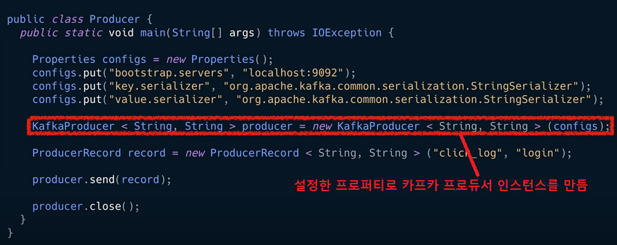
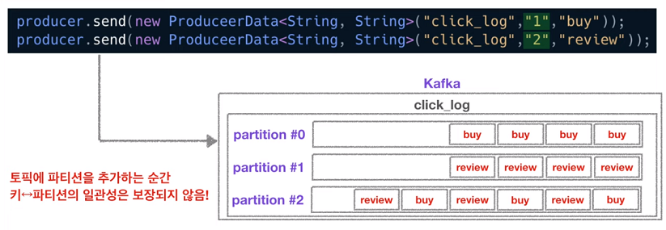
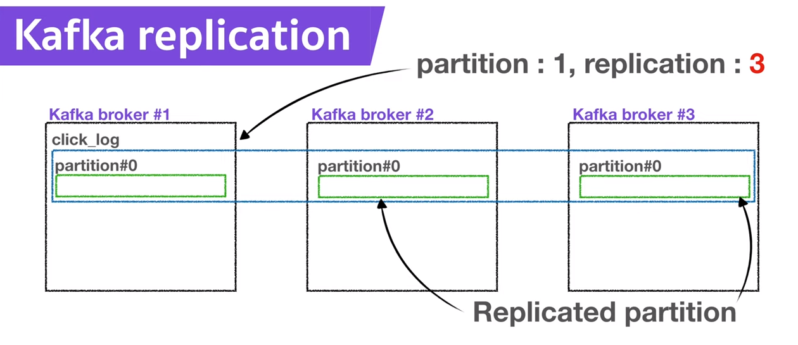
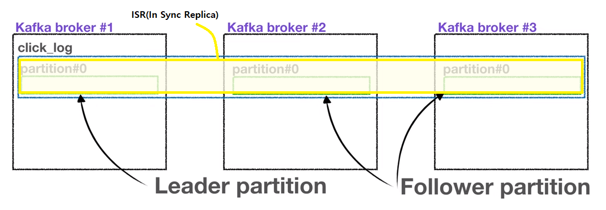
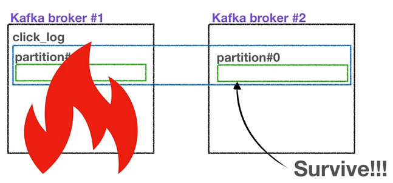
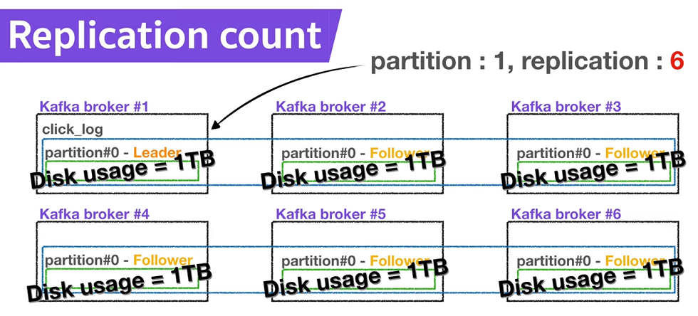

# Apache Kafka

[TOC]

**`강의` 아파치 카프카 | 데이터를 카프카로 전송🚀하는 프로듀서**

## 카프카 프로듀서란?

카프카 프로듀서란 데이터를 프로듀싱 즉 **생산**하는 역할을 한다.
즉 데이터를 kafka topic 에 생성한다는 말과 같다.

프로듀서는 데이터를 카프카에 **보내는** 역할도 하고 있다.
예를 들어, 엄청난 양의 클릭로그들을 **대량으로, 그리고 실시간으로** 카프카에 적재할 때 프로듀서를 사용할 수 있다.

### 프로듀서의 역할

- topic에 전송할 메시지를 생성할 수 있다
- 특정 topic으로 데이터를 publish, 전송할 수 있다
이를 통해 기본적인 카프카 데이터 전송이 완성된다.
- kafka broker로 데이터를 전송할 때 전송 성공여부를 알 수 있고, 처리를 실패할 경우 재시도할 수 있다.

 

카프카 클라이언트인 컨슈머와 프로듀서를 사용하기 위해서는 아파치 카프카 라이브러리를 추가해야 한다.
라이브러리는 gradle 이나 maven 같은 도구들을 사용하여 편리하게 가져올 수 있다.

카프카 클라이언트를 디펜던시로 잡을 때 주의할 점은 버전을 맞추는 것으로, 카프카는 브로커 버전과 클라이언트 버전의 **하위호환성**이 완벽하게 모든 버전에 대해서 지원하지 않기 때문이다.
일부 카프카 브로커 버전은 특정 카프카 클라이언트 버전을 지원하지 않을 수도 있다.

클라이언트 버전별 하위호환성에 대한 설명은 [하위호환성 참고 블로그 링크](https://blog.voidmainvoid.net/193)

 

### 카프카 프로듀서를 작성한 코드 참고

- 부트스트랩 서버설정을 로컬 호스트의 카프카를 바라보도록 설정

​	→ 카프카 브로커의 주소목록은 되도록이면 2개 이상의 ip와 port를 설정하도록 권장한다.
​		둘 중 한개의 브로커가 비정상일 경우 다른 정상적인 브로커에 연결되어 사용 가능하기 때문이다.
​		그러므로 실제로 애플리케이션을 카프카와 연동할 때는 반드시 2개 이상의 브로커 정보를 넣는 것을 추천한다.

- 나머지 key 와 value에 대해 스트링 **시리얼라이저[^1]**로 직렬화를 설정

​	→ 키는 메시지를 보내면, 토픽의 파티션이 지정될 때 쓰인다.

 

 

카프카 클라이언트에서 제공하는 ProducerRecord 클래스를 사용해 전송할 객체인 ProducerRecord 인스턴스를 생성할 때 어느 토픽에 넣을 것인지, 어떤 key와 value를 담을 것인지 선언할 수 있다.

이번 코드는 key없이 click_log 토픽에 login이라는 value를 보낸다.

 

만약 key를 포함하여 보내고 싶다면 빨간 상자 아래 코드와 같이 ProducerRecord 를 선언하면 된다.

파라미터 개수에 따라 자동으로 오버로딩되어 인스턴스가 생성되므로 이 점을 유의해서 ProducerRecord를 생성해야 한다.

 

데이터가 도착할 토픽, 데이터, 카프카 브로커의 호스트와 포트까지 데이터를 전송할 모든 준비가 되었다. 

이전에 생성된 프로듀서 인스턴스에 send()의 파라미터로 ProducerRecord를 넣으면 전송이 이루어지게 된다.

전송이 완료되면 close() 를 통해 프로듀서가 종료된다.

  

### 프로듀서가 전송한 데이터의 흐름

key가 null인 데이터를 파티션이 1개인 토픽에 보내면 다음과 같이 차례대로 쌓이게 된다.

파티션이 1개 더 늘어나면 key가 null이므로 데이터가 round-robin으로 2개의 파티션에 차곡차곡 쌓이게 된다.

 

반면에 key가 존재하는 데이터를 토픽에 보내면 key를 특정한 hash값으로 변경시켜 파티션과 1대 1 매칭을 시킨다. 즉, 각 파티션에 동일한 key의 value만 쌓이게 된다.

예시로 buy라는 value의 key를 1로, review라는 value의 key를 2라고 지정한다.

 

그런데 이 때 토픽에 새로운 파티션을 한 개 더 추가하면 key와 파티션의 매칭이 깨지기 때문에 key와 파티션 연결은 보장되지 않는다.

그러므로 key를 사용할 경우, 이 점을 유의하셔서 파티션 개수를 생성하고 추후에 생성하지 않는 것을 추천한다.

 

카프카 프로듀서의 기본적인 구현은 매우 간단하지만 **데이터 유실 혹은 브로커의 이슈에 대처**하기 위해서는 추가적인 옵션들과 코드가 필요하다.

 

 

## Broker, Replication, ISR 핵심요소

Broker, Replication, ISR 이 3가지 요소들은 카프카의 고가용성을 유지를 운영하는데 아주 중요한 역할을 하고 있다.

 **replication** 즉, 복제는 카프카 아키텍처의 핵심이다.
클러스터에서 서버가 장애가 생겼을 때 카프카의 가용성을 보장하는 가장 좋은 방법이 복제이기 때문이다.

 

### Kafka broker

Kafka broker는 카프카가 설치되어 있는 서버 단위를 말한다.

보통 3개 이상의 broker로 구성하여 사용하는 것을 권장한다.

만약 파티션이 1개이고 replication이 1인 topic이 존재하고 브로커가 3대라면 브로커 3대 중 1대에 해당 topic의 정보(데이터)가 저장된다.

 

### Kafka replication

replication은 partition의 복제를 뜻한다.

만약 replication이 1이라면  partition은 1개만 존재한다는 것이고 replication이 2라면 partition은 원본 1개와 복제본 1개로 총 2개가 존재한다.
만약 replication이 3이라면 partition은 원본 1개 복제복 2개로 총 3개가 존재하게 된다.

다만 브로커 개수에 따라서 replication 개수가 제한되는데 브로커 개수가 3이면 replication은 브로커 개수보다 많아질 수 없다.

여기서 원본 1개 partition은 Leader partition이라고 부른다. 그리고 나머지 2개 복제본 partition은 Follower partition이라고 부른다.
**Leader, Follower partition을 합쳐서 ISR** 즉, In Sync Replica 라고 볼 수 있다.

 

#### 왜 replication을 사용하는 것인가?

replication은 partition 의 고가용성을 위해 사용된다.

만약 브로커가 3개인 카프카에서 replication이 1이고 partition이 1인 topic이 존재한다고 가정해보자.
갑자기, 브로커가 어떠한 이유로 사용불가하게 되면 더이상 해당 파티션은 복구할 수 없다.

만약 replication이 2면 브로커 1개가 죽더라도 복제본 즉, Follower partition이 존재하므로 복제본으로 복구가 가능하다.

나머지 1개 즉, 남은 Follower parttion이 Leader partition역할을 승계하게 되는 것이다.

 

#### Leader partition과 Follower partition의 역할

프로듀서가 토픽의 partition에 **데이터를** 전달할 때 **전달받는 주체가 Leader partition**

프로듀서에는 partition의 replication과 관련이 있는 ack라는 상세 옵션이 있다.
이 상세옵션을 통해 고가용성을 유지할 수 있는데 **0, 1, all 옵션** 3개 중 1개를 골라서 설정할 수 있다.

 

- **0일 경우** 프로듀서는 Leader partition에 데이터를 전송하고 응답값을 받지 않는다.
  
  그렇기 때문에 Leader partition에 데이터가 정상적으로 전송됐는지 그리고 나머지 partition에 정상적으로 복제되었는지 알 수 없고 보장할 수 없다.
  이 때문에 **속도는 빠르지만 데이터 유실 가능성이 있다**.

   
  
- **1일 경우** Leader partition에 데이터를 전송하고 Leader partition이 데이터를 정상적으로 받았는지 응답값을 받는다.
  다만 나머지 partition에 복제되었는지는 알 수 없다.

  

  
  만약 Leader partition이 데이터를 받은 즉시 브로커가 장애가 난다면 나머지 partition에 데이터가 미처 전송되지 못한 상태이므로 이전에 ack 0 옵션과 마찬가지로 데이터 유실 가능성이 있다.

   
  
- **all 옵션일 경우** Leader partition에 데이터를 보낸 후 **나머지 follower partition에도 데이터가 저장되는 것(복제)**을 확인하는 절차(응답값)를 거친다.
  
  ack all 옵션을 사용할 경우 데이터 유실은 없다고 봐도 된다.
  그렇지만 0, 1 옵션에 비해 확인하는 부분이 많기 때문에 속도가 현저히 느리다는 단점이 존재한다.

 

#### Replication count

replication이 고가용성을 위해 중요한 역할을 한다면 replication이 많을수록 좋다고 생각할 수 있지만, replication이 많아질수록 그만큼 브로커의 리소스 사용량도 늘어나게 된다.

따라서 카프카에 들어오는 데이터량과 retention date 즉, 저장시간을 잘 생각해서 replication 개수를 정하는 것이 좋다.
3개 이상의 broker를 사용할 때 replication은 3으로 설정하는 것을 추천한다고 해당 강좌의 강사는 말함

> 이유는 차후 더 찾아봐야 할듯..;

 

 

 

## 참고자료

[아파치 카프카 | 데이터를 카프카로 전송🚀하는 프로듀서](https://www.youtube.com/watch?v=aAu0FE3nvbk&list=PL3Re5Ri5rZmkY46j6WcJXQYRlDRZSUQ1j&index=3)

[아파치 카프카 | Broker, Replication, ISR 👀핵심요소 3가지!](https://www.youtube.com/watch?v=qpEEoGpWVig&list=PL3Re5Ri5rZmkY46j6WcJXQYRlDRZSUQ1j&index=4)

 

 

[^1]: key 혹은  value를 직렬화하기 위해 사용됨, [Byte array, String, Integer 시리얼라이즈를 사용할 수 있다.]